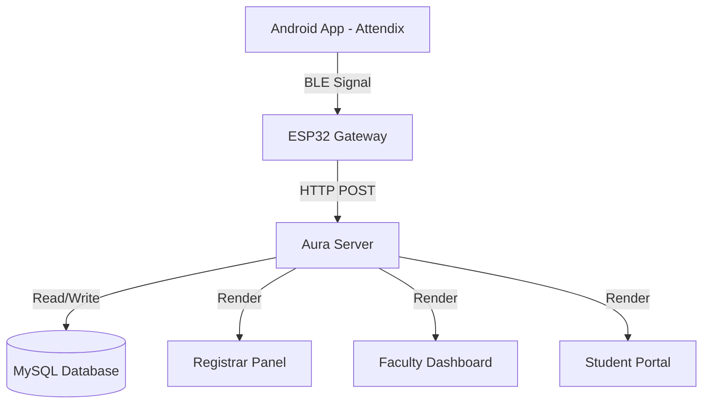
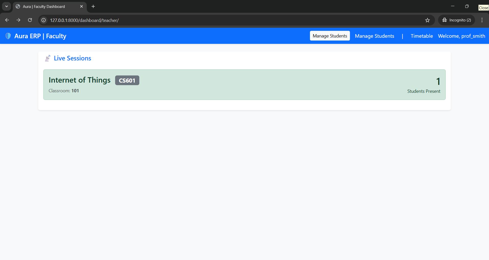
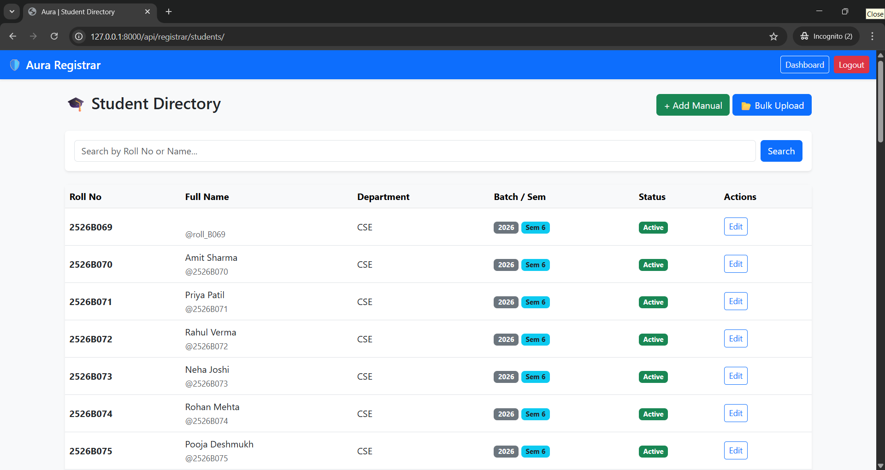
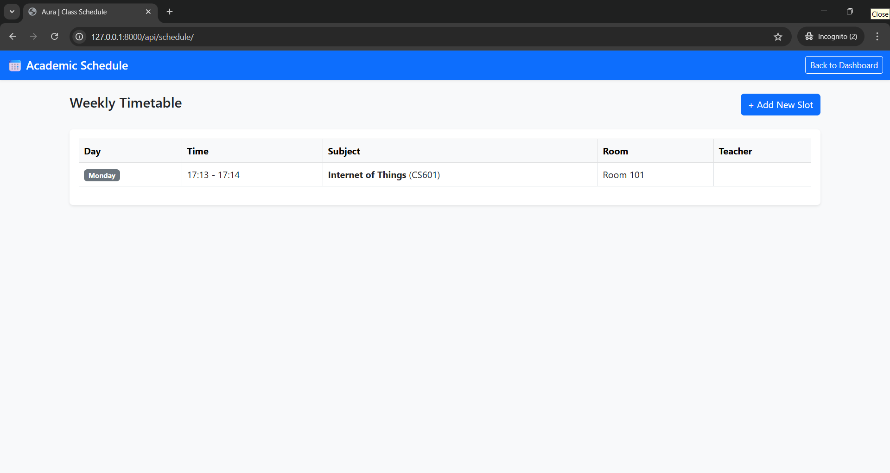

# 🛡️ Aura: Smart Campus ERP & IoT Attendance System


**Aura** is a next-generation Academic ERP that integrates **IoT-based Passive Attendance** into a full-stack college management system. 

Unlike traditional ERPs where attendance is manual, Aura uses a network of **ESP32 BLE Gateways** to detect students' smartphones as they walk into class. The system cross-references the student's location with the academic timetable to automatically mark attendance, creating a "Zero-Touch" environment.

---

## 🚀 Key Features

### 🏛️ 1. The Registrar (Academic Structure)
* **Hierarchy Management:** Full control over Departments, Batches, Semesters, and Divisions.
* **Student Directory:** Centralized database with search, filtering, and profile management.
* **Bulk Onboarding:** Powerful CSV/Excel importer to add hundreds of students in seconds.

### 📅 2. The Scheduler (Smart Timetable)
* **Automated Logic:** Define weekly schedules (e.g., *Mon 10:00 AM @ Room 101*).
* **Zero-Touch Sessions:** The system automatically identifies the active class based on the current time and room—no manual "Start Class" input required.

### 📡 3. The Sensor Grid (IoT Layer)
* **Passive Tracking:** ESP32 microcontrollers deployed in classrooms scan for encrypted BLE signals.
* **Privacy-First:** "Dumb Node" architecture—the ESP32 only captures encrypted IDs; the central server determines identity and validates the schedule.
* **Real-Time Dashboard:** Faculty can watch attendance fill up live on their screen.

### 📊 4. Analytics & Insight
* **Defaulter Intelligence:** Auto-calculates attendance percentages and flags students below the threshold (e.g., 75%).
* **Role-Based Access:** dedicated portals for **Faculty** (Class monitoring) and **Students** (Attendance history).

---

## 🏗️ System Architecture


---

## 🛠️ Tech Stack

- **Backend:** Python 3.11+, Django 4.2 LTS
- **API:** Django Rest Framework (DRF)
- **Database:** MySQL 8.0 (Production) / SQLite (Development)
- **Hardware (IoT):** ESP32 (C++ via Arduino Framework)
- **Mobile:** Android (Java/Kotlin)
- **Security:** Role-Based Access Control (RBAC), JWT Authentication

---

## 📦 Installation & Setup

Follow these steps to set up the Aura ERP on your local machine.

### 1. Clone the Repository

```bash
git clone https://github.com/HarshaTalap1474/AURA-ERP.git
cd aura-erp
```
### 2. Set Up Virtual Environment
```bash
# Widows
python -m venv venv
venv\Scripts\activate

# Mac/Linux
python3 -m venv venv
source venv/bin/activate
```
### 3. Install Dependencies
```bash
pip install -r requirements.txt
```

### 4. Database Initialization
#### Ensure your database settings in **settings.py** are correct.
```bash
# Create migration files
python manage.py makemigrations

# Apply migrations to create database tables
python manage.py migrate
```

### 5. Create Administrator
#### Create the superuser account to access the Registrar Panel.
```
python manage.py createsuperuser
# Follow the prompts to set username (e.g., admin) and password.
```

### 6. Run the Server
#### To allow ESP32 devices on the same Wi-Fi network to connect, listen on all interfaces **(0.0.0.0).**
```
python manage.py runserver 0.0.0.0:8000
```
---
## ⚡ Configuration Guide (Important)

Since the database starts empty, you must configure the college structure in the Admin Panel before the system can function.

### 1. Admin Login
- URL: http://127.0.0.1:8000/admin/

### 2. Add Department
- Create a Department  
  - **Name:** Computer Science  
  - **Code:** CSE  

### 3. Add Batch
- Create a Batch linked to the Department  
  - **Year:** 2026  

### 4. Add Semester
- Create a Semester  
  - **Name:** Semester 5  
  - ✅ Enable **Is Active**

### 5. Add Infrastructure
- Create a Classroom  
  - **Room Name:** Room 101  
  - **ESP Device ID:** ESP_ROOM_101  

### 6. Add Students
- URL: http://127.0.0.1:8000/registrar/students/
- Use **Bulk Upload** to import students

### 7. Set Timetable
- URL: http://127.0.0.1:8000/schedule/
- Add a class slot  
  - **Day:** Monday  
  - **Time:** 10:00 AM  
  - **Subject:** IoT  
  - **Room:** Room 101
---
## 🔌 API Documentation (IoT)

The ESP32 communicates with the server via a single secure endpoint.

### Endpoint
- **POST** `/api/attendance/scan/`

### Payload Format

```json
{
  "device_id": "ESP_ROOM_101",
  "scans": [
    "2526B069",
    "2526B070"
  ]
}
```
### Server Response:
```
{
  "status": "success",
  "class": "Internet of Things",
  "marked_new": 1,
  "total_present": 45
}
```

---
## 📸 Screenshots

### Teacher Dashboard


### Student Directory


### Timetable Manager


---
## 🤝 Contributing

- Fork the project.
- Create your feature branch (`git checkout -b feature/AmazingFeature`).
- Commit your changes (`git commit -m 'Add some AmazingFeature'`).
- Push to the branch (`git push origin feature/AmazingFeature`).
- Open a Pull Request.

---
## 🛡️ License
Distributed under the MIT License. See `LICENSE` for more information.

---


<p align="center">
  Built with ❤️ by <strong>Harshavardhan Talap</strong> | Project Fortress
</p>
